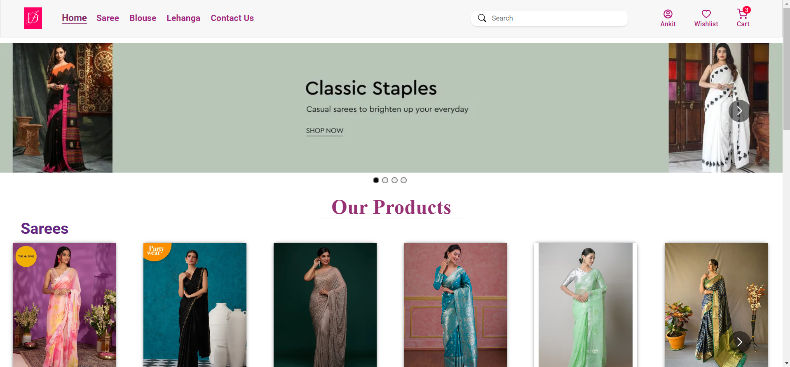

# MERN E-Commerce Website

Introducing my cutting-edge E-commerce platform, developed using the powerful MERN (MongoDB, Express.js, React, Node.js) technology stack. Seamlessly integrating frontend and backend components, our E-commerce project provides a feature-rich and user-friendly online shopping experience. From an engaging React-based user interface to a robust Node.js backend, our platform offers secure user authentication, dynamic product catalog management, responsive design, and streamlined checkout processes integrated through Rajorpay. Built on MongoDB, the database ensures efficient data storage and retrieval, while Express.js facilitates smooth API interactions. Embrace the future of online retail with our MERN E-commerce project, combining the best of modern web development to deliver a sophisticated and efficient shopping environment for both customers and administrators.




## Table of Contents

- [Features](#features)
- [Technologies](#technologies)
- [Screenshots](#screenshots)
- [Getting Started](#getting-started)

## Features

- User registration and login with encrypted credentials
- Persistent user sessions using browser cookies
- Secure authentication using middleware for cart and wishlist management
- Product search and filtering capabilities
- Cart and wishlist functionality for logged-in users
- Seamless integration of Razorpay's payment gateway
- Order history display for both new and past orders

## Technologies

- Frontend: React.js
- Backend: Node.js
- Database: MongoDB

## Screenshots

## Getting Started

1. Clone the repository:

```bash
git clone https://github.com/ankitkr2411/MernProjectDT.git
cd MernProjectDT

# Install frontend dependencies
cd client
npm install

# Install backend dependencies
cd ../server
npm install

